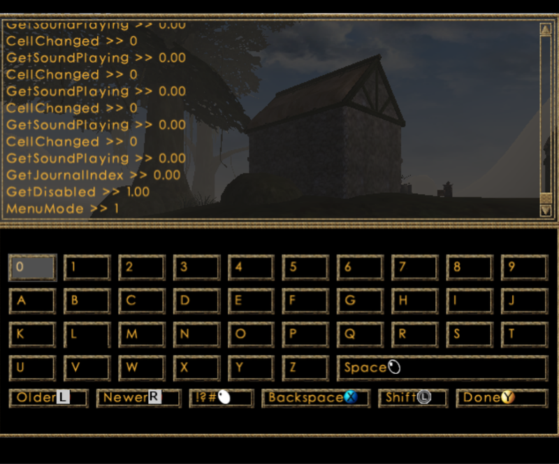

# TES3X

TES3X is a modding and patching toolkit for *Morrowind Game of the Year Edition* on the original Xbox. It
applies engine fixes to the retail XBE, extends its functionality, and can also assemble, optimize and deploy a list of mods directly to an Xbox.

## Requirements

- Python 3.12 or newer and Pillow (`python -m pip install Pillow`)
- A clean retail game folder containing `Default.xbe`, `morrowind.xbe`, `Morrowind.ini` and
  `Data Files`
- [LLVM](https://releases.llvm.org) for engine fixes and `delta-bsa` packaging; set `paths.llvm`
  if `clang` and `lld-link` are not on `PATH`
- A softmodded or hardmodded Xbox, or xemu
- An FTP server running on the Xbox (only if using `--deploy`)
- Optional: [mlox](docs/pipeline.md#sorting-plugins-with-mlox) to sort plugins by community rules

## Setup

The easiest way is the [GUI](#gui): on first start it asks where your
retail game and mod library are and how to reach the Xbox, and it creates and edits profiles for
you. To set up by hand instead, copy the example files:

```
cp examples/local.toml tes3x.local.toml
mkdir profiles
cp examples/profile.toml profiles/my-build.toml
```

In `tes3x.local.toml`, set `vanilla_root` to your unmodified Morrowind GOTY Xbox folder and, if
needed, add the LLVM and Xbox connection settings.
Each file in `profiles/` is one build: its name, mods and patches.

The mod library contains one directory per mod, with the layout each mod would use under
`Data Files`. Wrapper directories from extracted archives are detected automatically.
A profile picks mods by folder name. For versions and optional installer folders, index the
library into a `library.toml` and pick mods by id instead. See [the mod library](docs/mod-library.md).

For engine fixes only, remove `library` and every `[[mods]]` block. For mods without engine
fixes, set `preset = "minimal"`.

## GUI

`python tools/tes3x_gui.py` opens the TES3X GUI. It edits everything the text files hold: mods,
plugins, patches, `Morrowind.ini` settings, build settings and your local settings. It installs
mod archives into the library, and builds, tests and deploys. It lists the profiles in
`profiles/`, with New, Duplicate, Rename and Delete next to the list. It needs PySide6 and
tomlkit: `python -m pip install -r requirements-gui.txt`. See
[the mod library](docs/mod-library.md#gui).

## Build

The pipeline turns one profile into a complete, deployable game folder:

```text
   Local Settings + Profile + Mod Library
                  |
          Resolve and Check Mods
                  |
        Collect the Winning Files
                  |
       Pack Assets and Order Plugins
                  |
    Build Hooks and Patch the Retail XBE
                  |
      Stage the Complete Game Folder
                  |
          Test or Deploy to Xbox
```

### To run the pipeline

#### Validate and resolve the profile without building:
```
python tools/tes3x_pipeline.py profiles/my-build.toml --check
```

#### Build a profile (written to `build/pipeline/<name>/deploy`):
```
python tools/tes3x_pipeline.py profiles/my-build.toml
```

#### Use `--dry-run` to build and preview an FTP sync:
```
python tools/tes3x_pipeline.py profiles/my-build.toml --dry-run
```

#### Build and deploy to the Xbox via FTP:
```
python tools/tes3x_pipeline.py profiles/my-build.toml --deploy
```

`--deploy` synchronizes the build to `remote_root`; files there that are not in the build are
deleted. Use a separate destination, not an existing install you want to preserve. Saves and the
dashboard's `_resources` directory are not touched.

Connection settings come from command-line options, then `[deploy]` in `tes3x.local.toml`, then
the default `xbox`/`xbox` login. Set `TES3X_FTP_PASSWORD` or use `--ask-password` to keep the
password out of the config file.

You can also copy `build/pipeline/<name>/deploy` with another FTP client.

#### Before deployment, an optional xemu smoke test builds and exercises the exact profile in a live scenario:
```
python tools/tes3x_test.py profiles/my-build.toml --record
```

## Choosing engine fixes

The profile's `preset` selects a baseline:

| preset | contents |
|---|---|
| `minimal` | No optional engine fixes |
| `recommended` | Release fixes selected for general use |
| `testing` | `recommended`, preview fixes, diagnostics and the console |

Use `enable` and `disable` for individual patches; the example profile lists them all. Some
patches read settings from `Morrowind.ini`; see [ini keys](docs/ini-keys.md). See
[available patches](docs/patches.md), [candidates](docs/candidates.md), or run:

```powershell
python tools/tes3x_patch.py --list
```

## In-game console



The `testing` preset includes the preview console patch. Back + right thumb click opens it and A
raises the on-screen keyboard. `[Xbox] ConsoleCombo` changes the combination;
`disable = ["console"]` leaves it out.

See [testing and debugging](docs/testing.md) for the file format, the log, and the profiler.

## Diagnostics and profiling

The `testing` preset enables diagnostics, which append session,
crash and hang information to `E:\tes3xlog.txt`; fetch and summarize it with
`python tools/tes3x_diag.py pull`. Add profiler targets with the pipeline's repeatable
`--profile-target VA` option, then use the `tes3xprof` console command to write call counts and CPU
cycles to `E:\tes3xprof.bin`. Profile performance on a physical Xbox; xemu is useful only for
checking that the instrumented build runs.

## Packaging and overrides

`delta-bsa` keeps mod assets in a separate archive for smaller rebuilds and uploads, but requires
LLVM. `merged-bsa` needs no compiler and rebuilds `Morrowind.bsa`. Both pack mod files into an
indexed archive, so the Xbox doesn't have to search large folders for each file. `loose` ships
every mod file loose in `Data Files`, like a manual install: no archive and no LLVM, and the
easiest to inspect.

The annotated [example profile](examples/profile.toml) covers the common options. Command-line
values override it:

```
python tools/tes3x_pipeline.py profiles/my-build.toml --preset testing --enable video-arena
python tools/tes3x_pipeline.py profiles/my-build.toml --ini-set "General:Show FPS=1"
```

Set `hardlink_retail = true` in the local config to avoid duplicating unchanged retail files when
the source and build are on the same NTFS volume. See the
[configuration reference](docs/configuration.md) for every TOML option and
[pipeline options](docs/pipeline.md) for advanced workflows.

## Other tools

The pipeline uses these commands internally; they can also be run directly:

| tool | use |
|---|---|
| `tes3x_patch.py` | Patch an XBE directly. `--list` shows patches. |
| `tes3x_build.py` | Collect mods only, and report conflicts, texture sizes and missing masters. |
| `tes3x_pack.py` | Pack a collected mod tree into a game folder. |
| `tes3x_deploy.py` | Upload a game folder to the Xbox. |
| `tes3x_test.py` | Build and run a profile smoke test, or test a managed library one mod at a time. |
| `tes3x_xemu.py` | Build a profile and run it in xemu with a command file; see [testing](docs/testing.md#running-in-xemu). |
| `tes3x_gui.py` | The GUI. |
| `tes3x_library.py` | Scan, validate or convert to a versioned local mod library. |
| `tes3x_fetch.py` | Copy files back off the Xbox, such as saves or logs. |
| `tes3x_tour.py` | Write a script that walks through a plugin's cells logging free memory; summarize the log. |
| `tes3x_audit.py` | Check any `Data Files` folder for long names, junk files and duplicates. |
